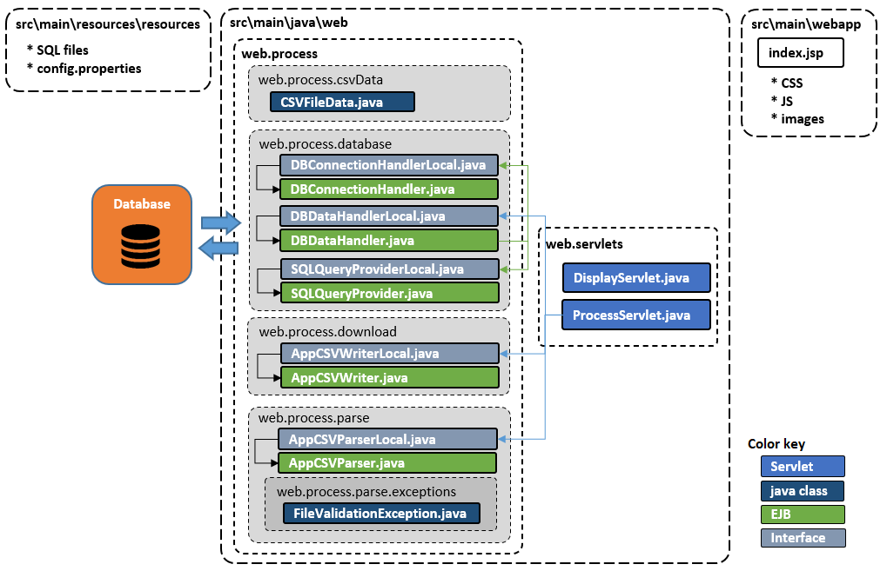

# DatabaseCsvFileIO
Web Application to read/write csv-file data from/to a database
### Project description
This Java web application can read a csv-file selected by the user and write it to a database. Also, it can download the data from the database into a csv-file.
This project uses the following technologies: JDK17, Glassfish server 6.2.5 (Jakarta EE 9.1), Servlets & JSP / JSTL, EJB, Apache Derby DBMS (SQL), Maven, Apache Commons (csv, lang, io), OpenCSV

### Purpose
The project was made to explore ways to read / write csv-file data using specialized libraries, as well as learn how to write csv-file data to a database and download it back into a csv-file.

### Key feature description
The application has web UI, the operation is controlled via JSP-page. The current functionality is as follows:
- read csv-file data using **_Apache Commons libraries_** or **_OpenCSV library_** and upload it into the database. The user is able to choose the file using the file browser, and select the desired reading method (library) via the selection dropdown list.
- observe current database records on the JSP-page.
- download data from the database into a file in the csv-format using **_Apache Commons libraries_** or **_OpenCSV library_** into the user home “downloads” folder. The file is named as **“content.csv”**.
- clear the current data in the database table.

### Usage example
The following demo gif shows the current functionality.

### Project structure
This project is Maven based. The structure is shown below.

**Web module:**
- `web.process` package contains Java classes and EJB to process the data that come from the csv-file.
  - `web.process.csvData` package contains `CSVFileData` class that keeps csv-file data: received from a csv-file to be written to the database or received from the database to be written to a csv-file.
  - `web.process.database` package contains EJBs that provide interaction with the database such as: establish (using DB configs from the `config.properties` resource file) and close database connection, get SQL queries from the resource SQL-files, perform select/insert/delete queries.
  - `web.process.download` package contains EJB that performs writing of the csv-format data (received from the database) into the HTTP Servlet response output stream (for further sending to the client as a character text data).
  - `web.process.parse` package contains EJB that parses the csv-file data (received from the JSP page form) and writes it into the object of `CSVFileData` class (for further upload the data to the database).
- `web.servlet` package contains Java Servlets that implement the controlling logic of user commands processing and csv-file data handling (received from the forms of `index.jsp` page).

**The project also contains:**
- `index.jsp` page (with user forms) that contains CSS, JS, images.
- the **resources** package that contains:
  - `config.properties` file with the database configuration.
  - SQL-files that contain SQL queries.
  
**The database** contains just one table `MYDATA` with 3 fields: `ID` (primary key), `TEXTDATA` (varchar), `DOUBLEDATA` (double).
